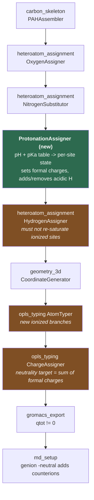

# feat: pH-dependent protonation states for O, N, and S sites

## Summary

Give the generator a `pH` parameter that decides, per ionizable site, whether that site is
protonated or ionized — and carry that decision intact through valence, OPLS typing, partial
charges, and GROMACS export so the resulting topology has a real, non-zero net charge.

Today every heteroatom the generator places is neutral by construction, and
`ChargeAssigner._equilibrate_charges` forces the net charge to exactly zero no matter what.
Those two facts together mean the package cannot currently represent a deprotonated carboxyl —
the dominant source of biochar cation exchange capacity in every soil at field pH.

---

## Problem Frame

Biochar's environmental behavior is largely a charge story. Carboxyls titrate around pH 3–6 and
phenolics around pH 8–11, so a flake at pH 7 carries net negative surface charge, and that charge
drives CEC, metal binding, and sorption. The generator can already *place* carboxyl, phenolic,
thiol, aniline-N, and pyridinic-N groups, but only ever in their neutral forms. A simulation of
"biochar in soil at pH 6.5" currently runs a structure that is chemically a low-pH structure.

Three concrete blockers exist in the code today:

1. **Neutral-only construction.** `OxygenAssigner._place_group`
   ([heteroatom_assignment.py:400](../../biochar/heteroatom_assignment.py#L400)) always attaches
   the acidic H. There is no ionized branch for any group.
2. **Charge is forcibly zeroed.** `ChargeAssigner._equilibrate_charges`
   ([opls_typing.py:270](../../biochar/opls_typing.py#L270)) computes `total_charge` and
   redistributes it across O and N atoms until the sum is zero — unconditionally. Any ionized
   site would be silently neutralized back. This *already* misrepresents graphitic N, which
   `NitrogenSubstitutor._substitute_graphitic`
   ([heteroatom_assignment.py:798](../../biochar/heteroatom_assignment.py#L798)) correctly gives a
   formal +1 that then gets smeared away.
3. **No ionized atom types.** `constants.py` has no atom types, LJ parameters, bond/angle terms,
   or `GROMACS_OPLS_TYPE_MAP` entries for any charged species.

A fourth, latent blocker is documented under Risks: `valence.py` would re-protonate deprotonated
oxygens.

### Scope of this plan

Discrete protonation states assigned **once per structure at build time**, sampled from
Henderson–Hasselbalch. This is not constant-pH MD — no λ-dynamics, no state changes during the
run. A generated structure is one sample from the ensemble at that pH.

---

## Requirements

| ID | Requirement |
|---|---|
| R1 | `GeneratorConfig` accepts a `pH` parameter; omitting it reproduces today's all-neutral output byte-for-byte. |
| R2 | Each ionizable site is independently ionized with probability `1/(1 + 10^(pKa − pH))`, drawn from the existing seeded RNG, so a given `seed` + `pH` is reproducible. |
| R3 | Ionizable sites are carboxyl, phenolic, thiol (deprotonation) and pyridinic N, aniline N (protonation). |
| R4 | Net molecular charge equals the sum of formal charges and is written to the `.itp` `qtot`; neutrality is left to `genion -neutral` at MD setup. |
| R5 | Every internal atom type maps to an `opls_XXX` name that exists in stock `oplsaa.ff`, or the plan explicitly records the derivation and its provenance. |
| R6 | `CompositionResult` reports the net charge and the per-group ionized/neutral census. |
| R7 | The valence system accepts anionic O/S (1 bond, −1) and cationic N (4 bonds, +1) without re-saturating them. |

---

## High-Level Technical Design

### Where the pH decision lands in the pipeline

The protonation decision is a **new stage between nitrogen substitution and hydrogen assignment**.
That position is forced: it must come after all heteroatoms exist (so there are sites to titrate),
and before `HydrogenAssigner` (which owns acidic H placement and would otherwise fight the
decision).



Green is new. Orange are existing components whose behavior must change.

### Protonation state table

Each row is one state transition. `pKa` is the acid dissociation constant of the **protonated**
form; `f_ionized = 1/(1 + 10^(pKa − pH))` is the probability the site is in the ionized column.

| Site | Neutral form | Ionized form | pKa | Charge when ionized |
|---|---|---|---|---|
| Carboxyl | Ar–COOH | Ar–COO⁻ | 4.2 | −1 |
| Phenolic | Ar–OH | Ar–O⁻ | 9.5 | −1 |
| Thiol | Ar–SH | Ar–S⁻ | 6.6 | −1 |
| Pyridinic N | Ar₂N | Ar₂NH⁺ | 5.2 | +1 |
| Aniline N | Ar–NH₂ | Ar–NH₃⁺ | 4.6 | +1 |

Note the sign convention differs between the two blocks: for the **acidic** sites `f_ionized` is
the fraction deprotonated (rises with pH); for the **basic** N sites the tabulated pKa belongs to
the conjugate acid, so the fraction *protonated* is `1 − f_ionized` and falls with pH. Getting this
inverted is the single easiest way to silently produce a structure with backwards charge, and U3's
test scenarios pin both directions explicitly.

Graphitic N is **not** in this table — it is permanently +1 by construction and does not titrate.

### The charge-neutrality inversion

The current contract is "net charge must be 0". The new contract is "net charge must equal the sum
of formal charges". This is a one-line change in intent but it inverts the meaning of the whole
method, so it is called out here rather than buried in U6:

```
# directional guidance, not implementation specification
target = sum(atom.GetFormalCharge() for atom in mol.GetAtoms())
residual = sum(charges.values()) - target
# distribute residual across polar atoms, as today
```

With `target` pinned to 0 for a neutral molecule this reduces exactly to today's behavior, which
is what makes R1 (byte-for-byte reproduction when `pH` is unset) achievable.

---

## Key Technical Decisions

**KTD1 — Stochastic per-site draw, not a threshold.** Each site draws independently against
Henderson–Hasselbalch. A deterministic `pH > pKa` threshold makes every carboxyl on every flake
flip at the same pH, giving a step-function titration curve and no site-to-site variation. The
stochastic draw makes a sweep across seeds an actual ensemble, which is what the existing
`sweep.py` machinery is built to consume. Cost: a single small flake is a sample, not the mean —
users need enough replicates near a pKa. *(Confirmed with user, 2026-07-16.)*

**KTD2 — Net-charged molecule; `genion` neutralizes.** The `.itp` carries the real `qtot` and
`md_setup.py`'s existing `genion -neutral` adds counterions at solvation. `md_setup.py` already
documents this exact contract ("GROMACS topology neutrality is still enforced by `genion -neutral`
at run time"), so this follows the established pattern rather than inventing a second one, and
keeps counterion identity under `ion_profile` control instead of hardcoding it at build time.
*(Confirmed with user, 2026-07-16.)*

**KTD3 — Only carboxylate has a stock OPLS type; the other three are derived.** This is the
highest-risk decision in the plan and is grounded in the stock `oplsaa.ff` tables (see Sources):

| State | Stock type | Decision |
|---|---|---|
| Carboxylate | `opls_271` (C), `opls_272` (O) | Use directly. |
| Phenolate | **none** | Derive. Nearest analogs: phenol O `opls_167`, aliphatic alkoxide `opls_420`. |
| Thiophenolate | **none** | Derive. Nearest analog: aliphatic thiolate S `opls_417` (`S in CH3S-`). |
| Pyridinium | **none** | Derive. Nearest analog: protonated cytosine N3 `opls_379` (an aromatic protonated N — closer than the alkylammonium types). |
| Anilinium | **none** | Derive. Nearest analog: `RNH3+` `opls_287` / H `opls_290`, parameterized for alkylammonium. |

Deriving means: take LJ from the nearest analog, take charges from the QM path where available,
and **record the provenance in a comment next to every derived constant**. A derived type whose
`GROMACS_OPLS_TYPE_MAP` target does not exist in `oplsaa.ff` makes `grompp` fail outright, so U4
carries a test that asserts every mapped name resolves against the real forcefield.

**KTD4 — pKa values are a static literature table.** `PROTONATION_STATES` in `constants.py` keyed
by group name, with the same provenance-comment discipline the existing `WOOD_*` constants use.
Local environment corrections (ortho substituents, charge–charge interaction between adjacent
ionized sites depressing the second pKa) are real effects but are deferred — see Open Questions.

**KTD5 — Protonation is its own stage, not a flag on `OxygenAssigner`.** A separate
`ProtonationAssigner` class keeps the "what groups exist" concern away from the "what state are
they in" concern, and means `OxygenAssigner`'s placement logic and its fallback table are
untouched. It also gives the pH engine one testable entry point.

---

## Implementation Units

### U1. pKa table and protonation-state data model

**Goal:** Land the chemistry constants and the state vocabulary everything else references.

**Requirements:** R3, part of R2.

**Dependencies:** none.

**Files:**
- `biochar/constants.py` (modify — add `PROTONATION_STATES`)
- `tests/test_protonation.py` (create)

**Approach:** Add `PROTONATION_STATES: dict[str, ProtonationState]` keyed by the group names
`OxygenAssigner` already uses (`carboxyl`, `phenolic`, `thiol`, `amino`) plus `pyridinic`. Each
entry carries pKa, the sign of the transition (acidic vs. basic), and the neutral/ionized atom
type pair. Follow the provenance-comment style of `WOOD_PENTAGON_FRACTION`
([constants.py:468](../../biochar/constants.py#L468)) — every pKa gets its source in a comment.

**Patterns to follow:** `FUNCTIONAL_GROUPS` in `constants.py` for the keyed-dict shape; the
`UC_DAVIS_DB_URL` / `MIN_BUILDABLE_AROMATICITY` block for provenance commenting.

**Test scenarios:**
- Every key in `PROTONATION_STATES` is a group name `OxygenAssigner` can actually place, or `pyridinic`.
- Every pKa is within its literature range (carboxyl 3–6, phenolic 8–11, thiol 6–8, pyridinic 4–6, amino 4–6).
- Each entry's `neutral_type` and `ionized_type` are both present in `OPLS_ATOM_TYPES` (this fails until U4 lands — mark `xfail` and flip it in U4).

**Verification:** The table imports and round-trips; no behavior change to any existing path.

---

### U2. Anionic O and cationic N in the valence system

**Goal:** Stop `HydrogenAssigner` from re-protonating deprotonated oxygens.

**Requirements:** R7.

**Dependencies:** none.

**Files:**
- `biochar/valence.py` (modify — `EXTENDED_VALENCES`, `get_valence_range`)
- `tests/test_valence.py` (modify)

**Approach:** `get_valence_range` ([valence.py:52](../../biochar/valence.py#L52)) only consults
`EXTENDED_VALENCES` when `atomic_num in EXTENDED_VALENCES`, and oxygen (8) is not a member. So an
O⁻ with a −1 formal charge falls through to the standard `(2, 2)` range, reports
`needed_valence = 1`, and `HydrogenAssigner._saturate_valences`
([heteroatom_assignment.py:898](../../biochar/heteroatom_assignment.py#L898)) dutifully adds an H
back — silently undoing the deprotonation. Add O to `EXTENDED_VALENCES` so that `charge < 0`
yields `(1, 1)`.

N (+1) already resolves correctly to `(4, 4)` via the existing positive branch, and S (−1) already
yields `(1, 2)`. Add characterization tests for both before touching the shared function.

**Execution note:** Add characterization coverage for the existing N/S charge branches before
modifying `get_valence_range` — it is shared by the skeleton builder and the oxygen assigner's
site finder, so a regression here is silent and wide.

**Test scenarios:**
- O with formal charge −1 and 1 bond: `needed_valence == 0`, `is_valid` is true.
- O with formal charge 0 and 1 bond: `needed_valence == 1` (unchanged — regression guard).
- N with formal charge +1 and 4 bonds: valid, not over-valent (characterization — must not change).
- S with formal charge −1 and 1 bond: `needed_valence == 0` (characterization — must not change).
- A phenolate O survives a full `HydrogenAssigner.assign_hydrogens` pass without gaining an H.
- Graphitic N (+1, 3 aromatic bonds) still validates as it does today.

**Verification:** `tests/test_valence.py` passes; a hand-built phenolate mol keeps its −1 O through hydrogen assignment.

---

### U3. `ProtonationAssigner` — the pH engine

**Goal:** Given a mol and a pH, set each ionizable site's protonation state.

**Requirements:** R2, R3, R6.

**Dependencies:** U1, U2.

**Files:**
- `biochar/protonation.py` (create — `ProtonationAssigner`)
- `biochar/heteroatom_assignment.py` (modify — `CompositionResult` gains `net_charge` and `ionized_counts`)
- `tests/test_protonation.py` (modify)

**Approach:** Detect ionizable sites by chemical environment (the same substructure logic
`AtomTyper._determine_atom_type` already uses to tell phenolic O from ether O), then for each site
draw `rng.random() < f_ionized` and apply the state: remove the acidic H and set formal −1, or add
an H and set formal +1. Own an instance `random.Random(seed)` exactly as `OxygenAssigner` and
`NitrogenSubstitutor` do — never touch global random state.

Record `net_charge` and a per-group ionized/neutral census onto the existing `CompositionResult`,
which is already the mutable record threaded through the pipeline.

Mind the acidic/basic sign inversion described in the High-Level Technical Design — the basic N
sites use `1 − f_ionized`.

**Execution note:** Implement test-first. The pH→state mapping is pure arithmetic over a seeded
RNG, so its behavior is fully pinnable before any molecule plumbing exists.

**Patterns to follow:** `NitrogenSubstitutor` ([heteroatom_assignment.py:571](../../biochar/heteroatom_assignment.py#L571))
for the seeded-RNG + placed-counts + graceful-degradation shape; `_swap_carbon_to_nitrogen` for
`RWMol` editing with formal charges.

**Test scenarios:**
- At pH = pKa, a structure with many carboxyls ionizes ~50% of them (statistical, tolerance-banded over many seeds).
- At pH = pKa − 3, essentially no carboxyl is deprotonated; at pH = pKa + 3, essentially all are.
- Same seed + same pH gives byte-identical results across runs.
- Different seeds at the same non-extreme pH give different site selections (proves it samples).
- **Sign inversion:** raising pH increases deprotonated carboxyls but *decreases* protonated pyridinic N.
- A deprotonated carboxyl has exactly one O with formal −1 and no acidic H; the C=O is untouched.
- A protonated aniline N has 4 bonds, formal +1, and 3 H.
- `net_charge` on `CompositionResult` equals the sum of formal charges.
- Molecule with zero ionizable sites at any pH: unchanged, `net_charge == 0`.
- pH far outside 0–14 raises or clamps with a warning rather than producing nonsense.
- Ether O, thioether S, and graphitic N are never touched by the assigner.

**Verification:** A titration sweep across pH 2→12 produces a monotonic net-charge curve, negative at high pH and positive at low pH.

---

### U4. OPLS types and parameters for ionized species

**Goal:** Give every ionized state an atom type, LJ params, bond/angle terms, and a real GROMACS mapping.

**Requirements:** R5.

**Dependencies:** U1.

**Files:**
- `biochar/constants.py` (modify — `OPLS_ATOM_TYPES`, `OPLS_LJ_PARAMS`, `GROMACS_OPLS_TYPE_MAP`, `OPLS_BOND_PARAMS`, `OPLS_ANGLE_PARAMS`)
- `tests/test_constants_ff.py` (create)

**Approach:** Add internal types for carboxylate (`O2-`/`C2-`), phenolate (`OM`), thiophenolate
(`SM`), pyridinium (`NPY+` and its H), and anilinium (`NA+` and its H). Carboxylate maps to the
stock `opls_271`/`opls_272`. The other four are derived per KTD3 — take LJ from the nearest analog
and comment the provenance and the analog's opls number on every line.

This unit is where the U1 `xfail` on type presence flips to passing.

**Test scenarios:**
- Every value in `GROMACS_OPLS_TYPE_MAP` matches the `opls_\d+` shape and is unique per internal type.
- **Every mapped `opls_XXX` name exists in the installed `oplsaa.ff/ffnonbonded.itp`.** Skip the test cleanly when GROMACS is absent rather than failing (mirror `test_qm_charges.py`'s handling of a missing MOPAC binary). This is the test that would have caught the phenolate/pyridinium gap.
- Every new internal type in `OPLS_ATOM_TYPES` has a matching `OPLS_LJ_PARAMS` entry.
- Every new bond/angle key references only types that exist in `OPLS_ATOM_TYPES`.
- Formal-charge sanity: the ionized O/S types carry more negative default charge than their neutral counterparts; the cationic N types carry more positive charge than theirs.

**Verification:** A generated ionized structure passes `grompp` against stock `oplsaa.ff` without unknown-atomtype errors.

---

### U5. `AtomTyper` branches for ionized states

**Goal:** Type an ionized site to its ionized OPLS type.

**Requirements:** R5.

**Dependencies:** U4.

**Files:**
- `biochar/opls_typing.py` (modify — `AtomTyper._determine_atom_type`)
- `tests/test_generator.py` (modify)

**Approach:** `_determine_atom_type` ([opls_typing.py:57](../../biochar/opls_typing.py#L57))
already branches on bond count and neighbor identity; add formal charge as a discriminator. An O
with 1 bond and −1 is carboxylate or phenolate depending on whether its neighbor is the carboxyl C
or a ring CA. An N with 4 bonds and +1 is pyridinium (in-ring) or anilinium (pendant) — reuse the
existing ring-membership test that already separates NPY/NPR/NGR from NA.

Watch the recursion: the H branch types itself by calling `_determine_atom_type` on its neighbor,
so each new heavy-atom type needs its H counterpart added to that dispatch.

**Test scenarios:**
- Carboxylate O⁻ types to the carboxylate O type, not `OH` or `O`.
- Phenolate O⁻ types to the phenolate type, not `OH` (which is the bug this branch prevents).
- Thiophenolate S⁻ types to the thiolate type, not `SH_`.
- Pyridinium N⁺ types to pyridinium, not `NPY`; its H types to the pyridinium H.
- Anilinium N⁺ types to anilinium, not `NA`; its H types to the anilinium H.
- Regression: with `pH` unset, every atom in a neutral structure types exactly as it does today.
- Ether O (2 bonds, 0 charge) still types `OS`; graphitic N (+1, 3 bonds) still types `NGR` and is *not* caught by the new N⁺ branch.

**Verification:** No atom in an ionized structure types to `X<atomic_num>`.

---

### U6. Formal-charge-aware charge assignment

**Goal:** Stop forcing net zero. This is the blocker fix.

**Requirements:** R4.

**Dependencies:** U5.

**Files:**
- `biochar/opls_typing.py` (modify — `ChargeAssigner._equilibrate_charges`, `OPLSPropertyTable.validate`)
- `tests/test_generator.py` (modify)

**Approach:** Retarget `_equilibrate_charges` ([opls_typing.py:270](../../biochar/opls_typing.py#L270))
from "sum to zero" to "sum to the total formal charge", per the sketch in the High-Level Technical
Design. Keep the existing residual-distribution mechanism and its preference for O/N atoms — only
the target changes.

Also relax `OPLSPropertyTable.validate` ([opls_typing.py:369](../../biochar/opls_typing.py#L369)),
whose `abs(charge) > 2.0` extreme-charge check and total-charge check are written around neutral
molecules.

This unit incidentally fixes the pre-existing graphitic-N bug: a structure with graphitic N has
had its +1 smeared away since that feature landed, and will now correctly report `qtot = +1`.

**Execution note:** Add a characterization test pinning today's neutral-molecule charges *before*
changing the target, so the R1 no-op guarantee is provable rather than asserted.

**Test scenarios:**
- Neutral molecule: charges are unchanged from today, sum to 0 (characterization).
- Structure with one carboxylate: charges sum to −1.0 within 1e-6.
- Structure with one anilinium: charges sum to +1.0.
- Mixed structure (2 carboxylate, 1 pyridinium): sums to −1.0.
- **Graphitic-N-only structure sums to +1.0, not 0** — this changes existing behavior; update the affected assertion and note the fix in the commit.
- Zwitterion (1 carboxylate + 1 anilinium): sums to 0.0 but individual formal charges are retained, not cancelled.
- `validate()` does not flag a legitimately ionized structure as having an extreme charge.

**Verification:** `qtot` in the exported `.itp` equals the sum of formal charges for every case above.

---

### U7. Wire `pH` through config, API, and CLI

**Goal:** Make pH reachable from every entry point.

**Requirements:** R1, R6.

**Dependencies:** U3, U6.

**Files:**
- `biochar/biochar_generator.py` (modify — `GeneratorConfig`, `BiocharGenerator.generate`)
- `biochar/cli.py` (modify — `--pH`)
- `biochar/sweep.py` (modify — allow `pH` as a sweep axis)
- `tests/test_cli.py`, `tests/test_sweep.py` (modify)

**Approach:** Add `pH: Optional[float] = None` to `GeneratorConfig`, defaulting to `None` =
today's all-neutral behavior. Follow the resolution precedence the existing composition params use
(`__post_init__`, explicit > derived > default). Insert the `ProtonationAssigner` call into
`generate()` between nitrogen substitution and hydrogen assignment, per the pipeline diagram.

`pH` as a sweep axis is the payoff — a titration series falls out of the existing `expand_grid`
with no new machinery.

**Patterns to follow:** `defect_fraction` / `heptagon_fraction` in `GeneratorConfig` for an
optional structural knob threaded config→generator→CLI→sweep.

**Test scenarios:**
- `pH` unset: output is identical to the pre-change generator for a fixed seed (the R1 guarantee, asserted against a committed reference structure).
- `pH=7.0` on a carboxyl-bearing structure: net charge is negative.
- `pH=2.0` on the same structure: net charge is ~0 or positive.
- `biochar-gen --pH 7` runs and reports net charge.
- `--pH` outside 0–14 exits with a clear message, not a traceback.
- A sweep over `pH: [3, 5, 7, 9, 11]` produces 5 points with monotonically decreasing net charge.
- `pH` reaches `generate_surface()` and every sheet in a stack titrates independently.

**Verification:** `biochar-gen --pH 7 --O-C-ratio 0.2` emits a `.itp` with non-zero `qtot`.

---

### U8. Export, validation, and net charge in the manifest

**Goal:** Carry net charge into the artifacts and validate it end-to-end.

**Requirements:** R4, R6.

**Dependencies:** U6, U7.

**Files:**
- `biochar/gromacs_export.py` (modify — `qtot` comment, `.top` charge note)
- `biochar/validation.py` (modify — net-charge check)
- `biochar/sweep.py` (modify — `net_charge` in the manifest)
- `tests/test_gromacs_export.py`, `tests/test_validation_extended.py` (modify)

**Approach:** The `.itp` writer already emits per-atom charges and a `qtot` running comment
([gromacs_export.py:213](../../biochar/gromacs_export.py#L213)); make sure the final `qtot` is
correct and surfaced rather than assumed zero. Add a `ValidationEngine` check that the summed
partial charge matches the summed formal charge within tolerance — that catches a whole class of
typing bugs cheaply.

Record `net_charge` per point in the sweep manifest so `md_setup` consumers can see the charge
budget without re-deriving it. Note this is the *reporting* half of KTD2 — `genion -neutral` still
does the actual neutralizing, and no counterion is added at generation.

**Test scenarios:**
- `.itp` for an ionized structure has final `qtot` equal to net formal charge.
- `.itp` for a neutral structure still has `qtot ≈ 0` (regression).
- Charges written to `.itp` sum to the same value the `OPLSPropertyTable` reports.
- `ValidationEngine` flags a structure whose partial-charge sum diverges from its formal-charge sum.
- `ValidationEngine` does *not* flag a correctly ionized structure.
- Sweep manifest carries `net_charge` per point, and `setup_md_from_manifest` consumes a manifest with the new field without error.
- Multi-sheet surface `.top` reports the correct total system charge across sheets.

**Verification:** Full suite green; a `pH=7` structure round-trips through `biochar-md-setup` and `genion -neutral` adds the expected counterion count.

---

## Scope Boundaries

### In scope
The five titratable sites in the protonation-state table, assigned once at build time, carried through to a net-charged GROMACS topology.

### Deferred to follow-up work
- **Environment-corrected pKa.** Adjacent ionized sites depress each other's pKa; ortho substituents shift it. Real, measurable, and orthogonal to the state machinery — worth doing once static pKa lands and can be compared against.
- **Lactonic groups (pKa 7–9).** Titrate in the environmentally interesting window, but `lactone` currently falls back to `phenolic` ([heteroatom_assignment.py:208](../../biochar/heteroatom_assignment.py#L208)) and does not exist as a real group. Blocked on lactone placement, not on this plan.
- **Explicit counterions at generation.** Rejected in KTD2 for now; revisit only if a use case needs a self-contained neutral `.gro`.
- **QM/ML charge paths for ionized species.** `qm_charges.py` and `ml_charges.py` are untouched here; whether 1.14*CM1A behaves on anions needs its own investigation.
- **Pre-existing: the neutral thiol S mapping looks wrong.** `GROMACS_OPLS_TYPE_MAP` maps
  `SH_ → opls_202` and comments it "aromatic thiol sulfur (Ar-SH)"
  ([constants.py:105](../../biochar/constants.py#L105)), but stock `atomtypes.atp` describes
  `opls_202` as `all-atom S: sulfides, S=C` — the thiophenol sulfur is `opls_734`
  (`all-atom S: thiophenol (HS is #204)`). The paired `HSH → opls_204` mapping is correct
  (`atomtypes.atp` explicitly notes thiophenol's HS is #204). Found while verifying types for
  KTD3. Out of scope here — it affects the existing *neutral* thiol path, not protonation — but
  it should be confirmed and fixed on its own, since it silently mis-parameterizes every
  thiol-bearing structure generated today.

### Out of scope
- **Constant-pH MD (λ-dynamics).** A fundamentally different simulation method requiring GROMACS-level support, not a generator feature. Structures here have fixed protonation for the whole run.
- **Point of zero charge / titration-curve prediction as a product feature.** A net-charge-vs-pH curve falls out of a sweep, but fitting or reporting a PZC is analysis, not generation.
- **Re-parameterizing the existing neutral types.**

---

## Risks & Mitigations

| Risk | Impact | Mitigation |
|---|---|---|
| **Derived FF params for 4 of 5 ionized states** (KTD3). Phenolate, thiophenolate, pyridinium, and anilinium have no stock OPLS type. Wrong LJ or charges give plausible-looking but wrong MD. | High | U4's test asserts every mapped name resolves against real `oplsaa.ff`, so a missing type fails loudly at test time instead of silently at `grompp`. Provenance comments on every derived constant. Flagged as the top open question below. |
| **`valence.py` silently re-protonates O⁻.** `get_valence_range` omits O from `EXTENDED_VALENCES`, so `HydrogenAssigner` adds the H straight back. | High — would defeat the whole feature with no error | U2 fixes it first and pins it with a test that runs a phenolate through hydrogen assignment. |
| **Graphitic-N behavior change.** U6 makes `qtot` +1 where it was 0. Correct, but it changes existing output. | Medium | Called out in U6's scenarios; existing assertion updated deliberately and the fix noted in the commit rather than slipped in. |
| **Charge-group (`cgnr`) partitioning.** OPLS convention wants neutral charge groups; an ionized group is inherently ±1. Poor `cgnr` assignment hurts electrostatics with a cutoff scheme. | Medium | Not addressed in this plan — see Open Questions. Modern PME setups are far less sensitive than cutoff schemes. |
| **Statistical sampling near a pKa.** One small flake at pH ≈ pKa is a coin flip, and a user may read a single structure as representative. | Medium | Inherent to KTD1. `CompositionResult` reports the ionized census so the sampling is visible; document that pH near a pKa needs replicates. |
| **Net-charged system in MD.** A charged system under PME needs a neutralizing background or counterions. | Low | `genion -neutral` already handles this and `md_setup.py` documents the contract (KTD2). |

---

## Open Questions

1. **How should derived FF parameters be validated?** (Top risk, KTD3.) Options: accept the
   nearest-analog derivation with provenance comments; validate against QM via the existing
   `qm_charges.py` MOPAC path; or restrict the first release to carboxylate only (the one state
   with stock types) and land the rest behind the validated parameters. **Recommend** landing the
   full set with provenance and a `grompp`-resolution test, then revisiting against QM — but this
   is a chemistry judgment call worth making explicitly before U4.
2. **Charge-group partitioning for ionized groups.** Deferred to implementation; needs a look at
   what `gromacs_export.py` currently does with `cgnr` before deciding whether it matters here.
3. **Should `pH` interact with the temperature/feedstock model?** `temperature_model.py` derives
   composition from pyrolysis conditions. pH is an *environmental* variable, not a pyrolysis one,
   so they are probably independent — but biochar pH itself is a known function of pyrolysis
   temperature, and a user may reasonably expect `temperature` to suggest a default pH. Flagged,
   not resolved.

---

## Sources & Research

**Stock OPLS-AA atom types** — verified directly against
[`gromacs/share/top/oplsaa.ff/atomtypes.atp`](https://github.com/gromacs/gromacs/blob/main/share/top/oplsaa.ff/atomtypes.atp)
(fetched 2026-07-16). Carboxylate `opls_271` (`C in COO- carboxylate`) and `opls_272`
(`O: O in COO- carboxylate,peptide terminus`) confirmed present. Phenolate, aryl thiolate,
pyridinium, and anilinium confirmed **absent** — the nearest analogs are aliphatic alkoxide
`opls_420` (`O in CH3O-`), aliphatic thiolate `opls_417` (`S in CH3S-`), protonated cytosine N3
`opls_379` (`CytH+ N3`), and `opls_287`/`opls_290` (`N (RNH3+)` / `H (RNH3+)`) respectively. This
finding is what drives KTD3 and the top risk.

**`valence.py` O⁻ defect — verified by execution, not inference.** `get_valence_range` is pure
(its rdkit import is module-level but unused by the function), so it was executed directly against
the real source: `get_valence_range(8, -1)` returns `(2, 2)`, because `EXTENDED_VALENCES` has keys
`[7, 16]` only. A 1-bond phenolate O therefore reports `needed_valence = 1`. Confirms U2.

**pKa ranges for biochar surface groups** — carboxylic 3–6, lactonic 7–9, phenolic 8–11 (with
phenolic hydroxyl more tightly 9–10), from potentiometric and Boehm titration work:
- [Impact of Feedstock on Biochar Surface Properties: Boehm's and Potentiometric Titration](https://www.academia.edu/97610493/Impact_of_Feedstock_on_Biochar_Surface_Properties_Practical_Application_of_Boehm_s_and_Potentiometric_Titration)
- [Proton uptake behaviors of organic and inorganic matters in biochars prepared under different pyrolytic temperatures](https://sciencedirect.com/science/article/abs/pii/S0048969720343771)
- [pKa determination of graphene-like materials: Validating chemical functionalization](https://www.sciencedirect.com/science/article/pii/S0021979716300133)
- [Methodological limitations to determining acidic groups at biochar surfaces via the Boehm titration](https://www.sciencedirect.com/science/article/abs/pii/S0008622313008981)

Model-compound pKa values in the state table (benzoic acid 4.2, phenol 9.95→9.5, thiophenol 6.6,
pyridine 5.2, aniline 4.6) are standard literature values and should get individual citations in
the `constants.py` provenance comments at U1.

**Existing local patterns leaned on:** `NitrogenSubstitutor` (seeded RNG + graceful degradation +
placed-counts), `GeneratorConfig.defect_fraction` (optional knob threaded config→CLI→sweep),
`md_setup.py` `IonProfile` / `genion -neutral` (the neutrality contract KTD2 follows),
`test_qm_charges.py` (skipping cleanly when an external binary is absent — the pattern U4's
`grompp` test reuses).
